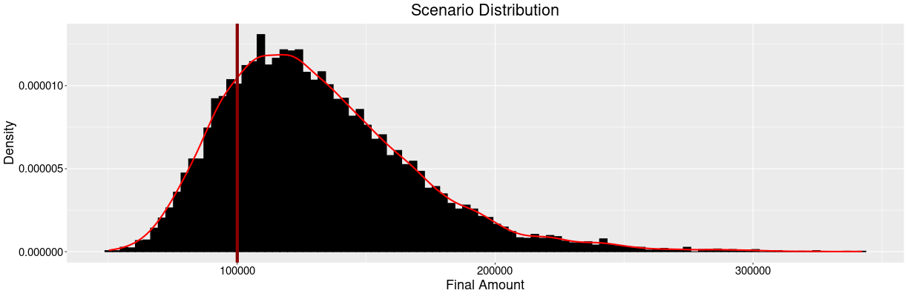

# Monthly Savings Calculator

  

  <i>Sample Scenario Distribution of a Given Set of Input Parameters</i>

This [R Shiny web application](https://yannickkaelber.shinyapps.io/MonthlySavings/) is designed to compute the minimum monthly savings required to reach a desired final amount of savings after a specified number of years. The app allows users to choose from different distributions for sampling monthly returns: Normal Distribution, Portfolio Distribution, and Empirical Distribution. Users can also upload their own empirical data for sampling returns.

## Features

- Input initial amount, desired final amount, number of years, and probability of success.
- Choose the distribution for sampling monthly returns:
  - Normal Distribution
  - Portfolio Distribution
  - Empirical Distribution (with file upload)
- Simulate monthly returns and calculate the required monthly savings.
- Visualize the results with histograms and cumulative distribution functions (CDF).
- Generate insightful textual output based on the calculations.

## Optimization Problem

The underlying mathematical optimization problem aims to determine the minimum monthly savings $S$ that need to be invested to reach the final amount $A_{final}$ with a given probability of success $P_{success}$.

$$
\min S \quad \text{such that} \quad \Pr\left( A_{\text{end}} \geq A_{\text{final}} \right) \geq P_{\text{success}}
$$

Given:
- Initial amount $A_{initial}$
- Desired final amount $A_{final}$
- Number of years $N$
- Probability of success $P_{success}$
- Monthly return distribution $R_{monthly}$
